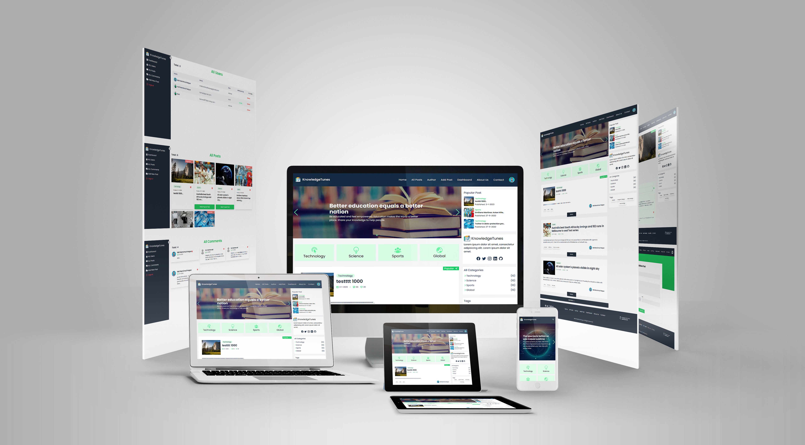

# KnowledgeTunes - A Blog website

Live : [KnowledgeTunes](https://knowledgetunes-13b9a.web.app/?fbclid=IwAR3mXTZPRQ4bTB9LfhUbl_o3MK-CnZkNTnqb8kSnlPK-7RGcaJj1M9rG3Fs).

## `Admin access`
Email : admin@gmail.com
Password : 123456

### `Tools used` :
<h4>Client site :</h4>
<ul>
<li>React.JS</li>
<li>TypeScript</li>
<li>TailwindCSS</li>
<li>React Router DOM</li>
<li>React Hook Form</li>
<li>swiper slider</li>
<li>React Icons</li>
<li>React Toastify</li>
<li>sweetalert2</li>
<li>Firebase Authentication</li>
</ul>

<h4>Server site :</h4>
<ul>
<li>Node.JS</li>
<li>Express.JS</li>
<li>TypeScript</li>
<li>MongoDB Database</li>
<li>dotenv</li>
<li>Vercel(for hosting)</li>
</ul>

